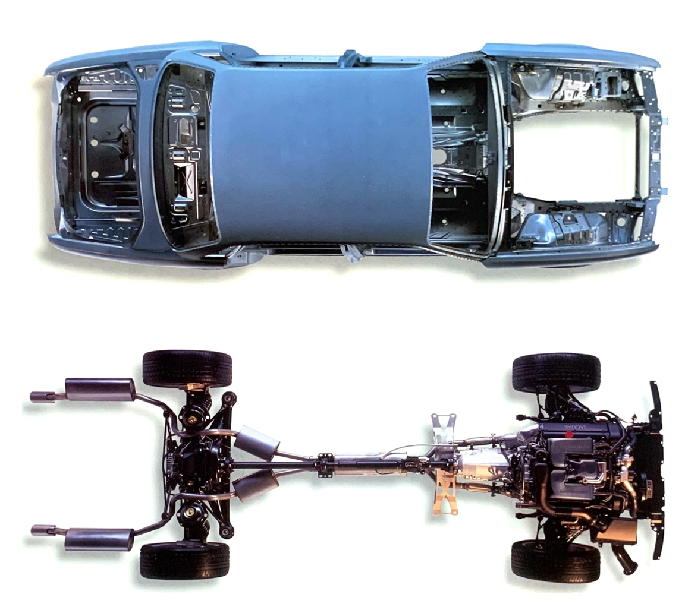

# XJR EV-Conversion
Welcome to the EV-Conversion project! 
This repository is dedicated to the development of tools, documentation, and resources for converting the Jaguar XJR (x308) to EV.
___
## Original Automotive (ICE)
### Overview
|             | Jaguar XJR |
| ----------- | ---------- |
| Year        | 1998       |
| Weight      | 1775 kg    |
| Total Weight      | 2260 kg    |
| Wheelbase   | 2870 mm    |
| Track       | 1498 mm    |
| Wheel base       | 2995 mm    |
| Length       | 5024 mm    |
| Width       | 1798 mm    |
| Performance | 375 PS     |
| Torque      | 525 Nm     |
| 0-100       | 5.6 s      |
| Drag Coefficient      | $c_w$: 0.37      |

*(Source: Sales Brochure 1997, jld/13/01/01/98)*

**Bodywork & Drive train layout:**

### Weights of Components
In order to calculate the weight budget for the EV conversion, components of the ICE variant need to be evaluated. 

#### Propulsion

| Component            | Description | Weight | Comment | Source  |
| ----------- | ---------- |---------- | ----------  |----------  |
| Engine 4.0 SC        | with accesoirs     | 227 kg | -  | workshop manual  |
| 5G-Tronic Gearbox      | without drive shaft    | 85 kg | -  | not verified  |
| Gasoline     | total of 81L, density: ca. 0.75 kg/L      | 60.75 kg | -  |  owners manual  |
| Exhaust system & Catalysator     | heavy stainless steel unit     | 50 kg | -  | not verified  |
| Fuel tank & fuel lines     | -   | 10-15 kg | -  | not verified  |

#### Audio
Modern headunits as the "Blaupunkt Bremen SQR 46 Dab" include all the functions of the original, adding bluetooth, DAB, etc. while
having a lower weight (0.85 kg)

| Component            | Description | Weight | Comment | Source  |
| ----------- | ---------- |---------- | ----------  |----------  |
| Radio Head Unit       | -     | - | Replaced by lightweight Aftermarket Radio with Bluetooth, DAB, etc.  | -  |
| Mobile Phone     | OEM-Phone in center console    | ? | obsolete  | not verified  |
| Radio Antenna     | including motor, brackets, control unit, antenna, etc.      | 0.95 kg | obsolete  |  -  |
| CD-Changer     | installed in trunk  | 1.8 kg | obsolete  | not verified  |

___
## EV-Conversion: 

Goal: 
- maintaining Jaguar IRS
- no excessive weight penalty, weight distribution improved
- ...

Missing ressources:
- Manuals and Drawings
- CAN-Documentation (speedometer, J-Gate, etc.)
- ...

